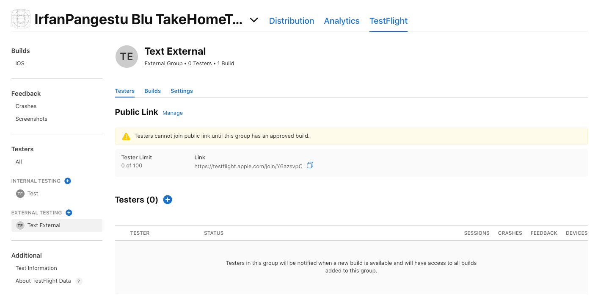
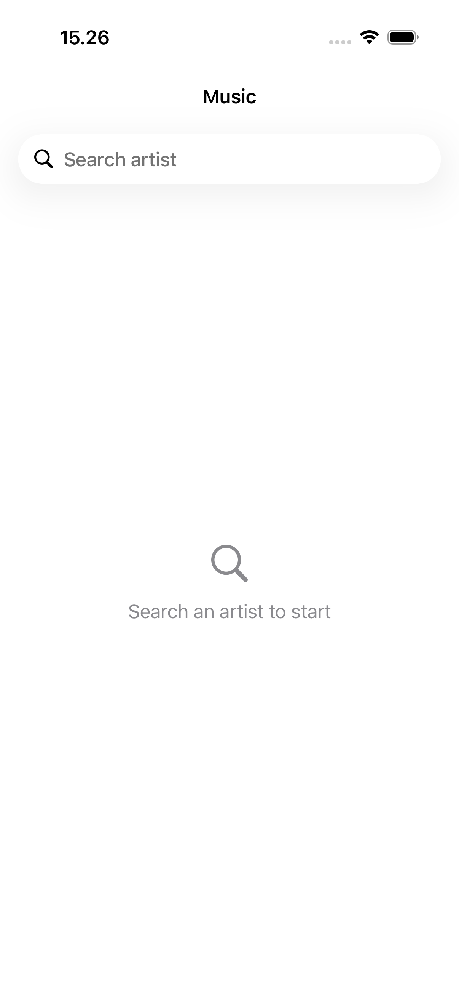
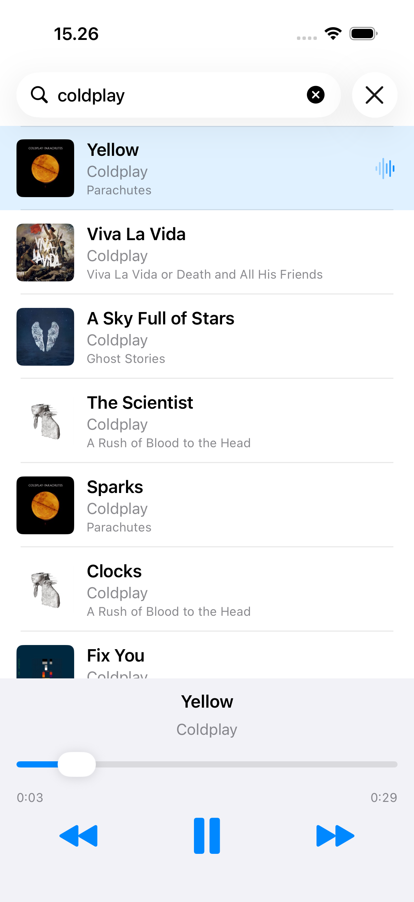
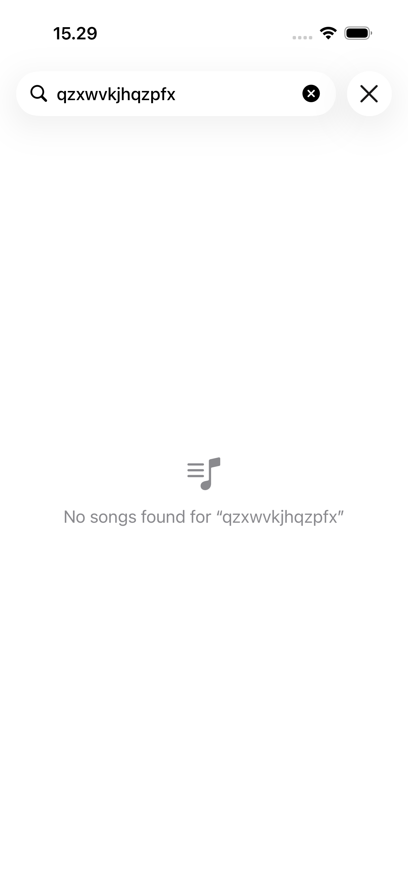
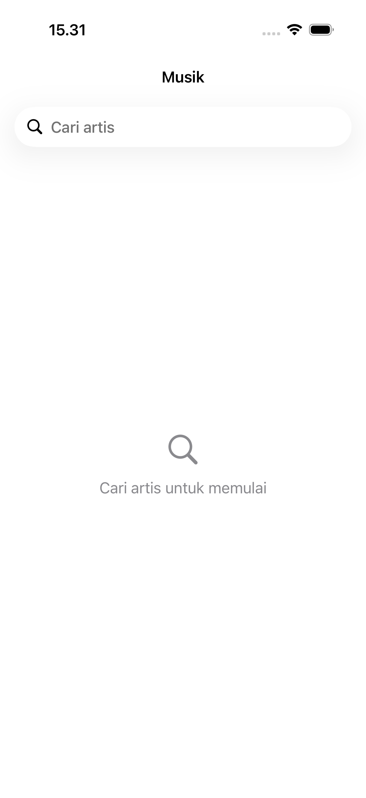
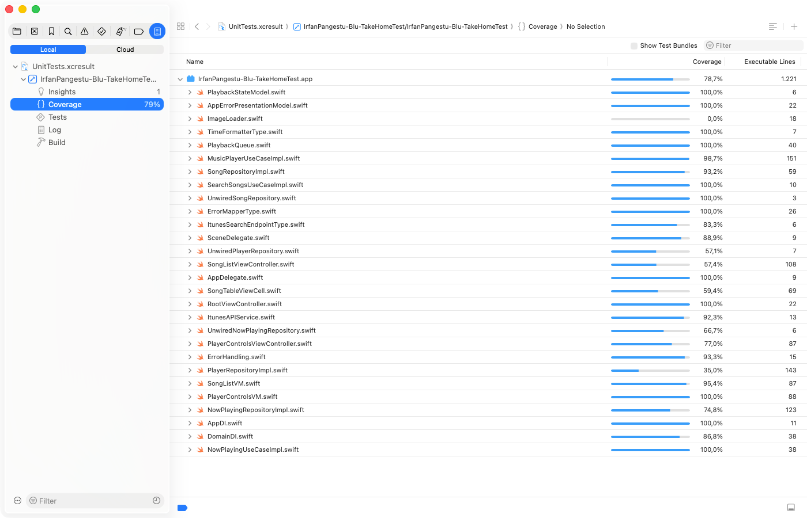

# IrfanPangestu-Blu-TakeHomeTest — Music Player

Halo, Saya Nur Irfan Pangestu, Senior iOS Engineer. Kalau mau kenal lebih jauh, mampir aja ke portofolio saya di [irfanpangestu.dev](https://irfanpangestu.dev/).

## Install

Take home test dapat di install melalui link berikut https://testflight.apple.com/join/Y6azsvpC

Kalau link TestFlight belum bisa dipakai, artinya build masih dalam tahap review oleh Apple.

Selama masih direview, bisa juga lewat:
- Diawi: https://i.diawi.com/WPRRc2
- Install On Air: https://ioair.link/k8nufe (berlaku sampai 5 Oktober 2026)

Diawi dan Install On Air hanya dapat dipakai di iPhone yang UDID-nya sudah terdaftar. Untuk mencoba lewat dua link tersebut, kirimkan UDID iPhone ke saya melalui kontak di [irfanpangestu.dev](https://irfanpangestu.dev/) atau bisa melalui whatsapp di nomor berikut 081513752010. UDID dapat dilihat di https://webapp.diawi.com/device (buka di Safari).

## Screenshots

| Layar awal | Lagu diputar | Hasil kosong | Bahasa Indonesia |
| :---: | :---: | :---: | :---: |
|  |  |  |  |

## Code Coverage

